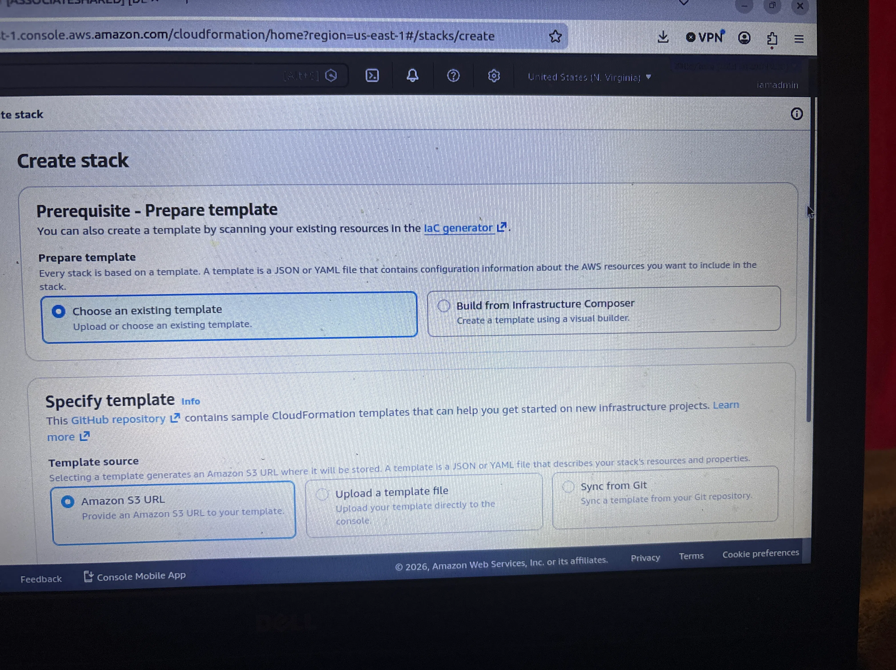
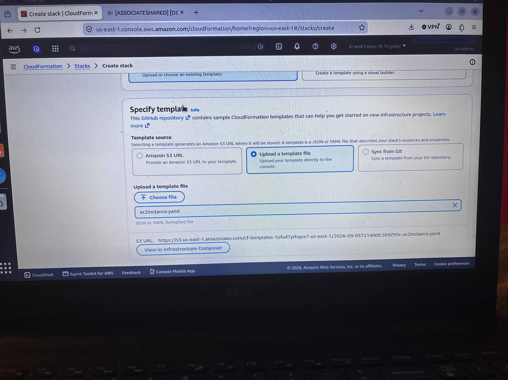
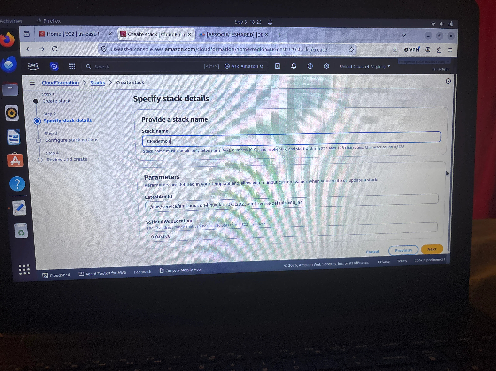

# Automating AWS Infrastructure with CloudFormation

## Project Overview
In this project, I deployed AWS infrastructure using Infrastructure as Code (IaC) with AWS CloudFormation while studying AWS cloud architecture. 

The purpose of this project is to understand how to automate the creation of AWS resources using YAML/JSON templates, reducing manual configuration and ensuring consistent environments.

## AWS Services Used
- AWS CloudFormation
- Amazon S3 (for template storage)
- Amazon EC2 (or other resources created by the template)
- AWS IAM

## Step 1 – Open CloudFormation Console
I navigated to the AWS CloudFormation console and selected "Choose an existing template" to begin creating my stack.

## Step 2 – Create Stack from Template
I selected "Template is ready" and used the "Upload a template file" option to upload my `ec2instance.yaml` file.

## Step 3 – Specify Stack Details
I named the stack `CFSdemo1` and specified the required parameters for the AMI and SSH access.

## Step 4 – Configure Stack Options
I configured stack options, including adding appropriate tags to track resources.

## Step 5 – Review and Create
I reviewed the template configuration, acknowledged the IAM capabilities required, and clicked **Submit** to create the stack.

## Step 6 – Verify Resources
I monitored the stack events until it reached `CREATE_COMPLETE` and verified the resources created in the "Resources" tab.

## What I Learned
This lab helped reinforce my understanding of:
- How CloudFormation uses templates (JSON/YAML) to provision infrastructure.
- How to manage infrastructure as code for repeatable deployments.
- How to use events and resource tabs to monitor deployment status.
- How to delete a stack to clean up all associated resources automatically.

## Project Status
✅ **Complete** - Successfully deployed and cleaned up a CloudFormation stack.
