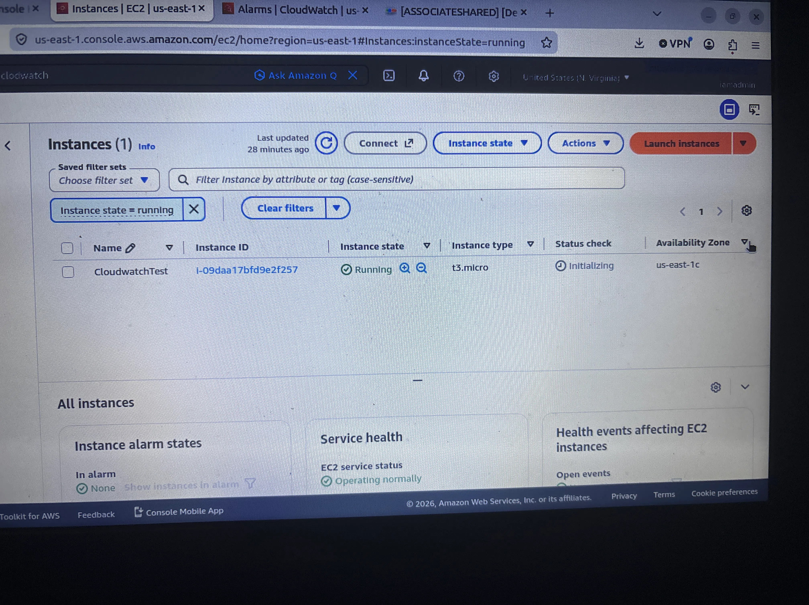
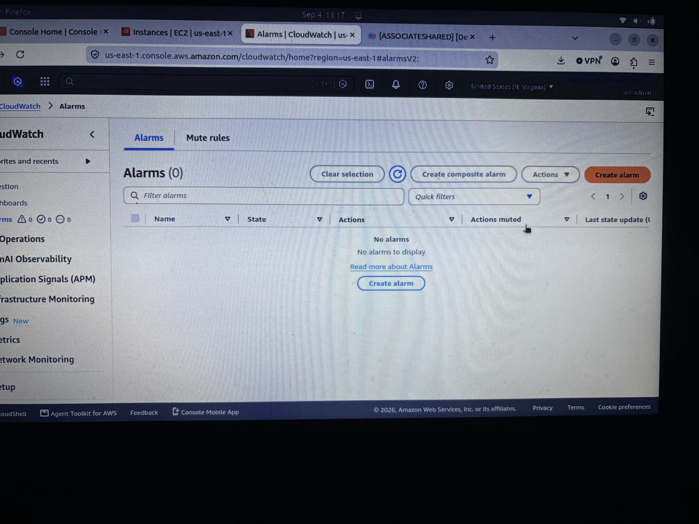
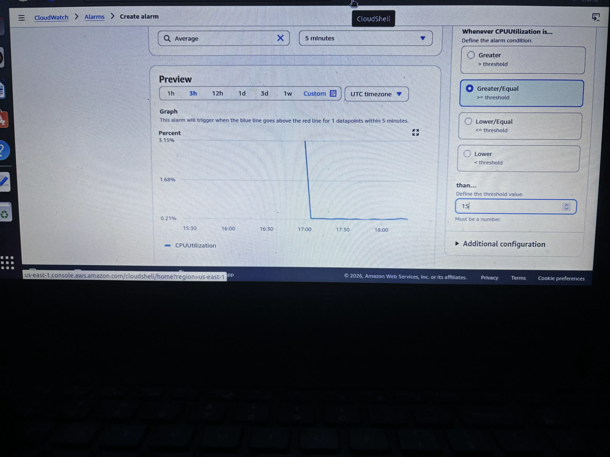

# Simple Monitoring with CloudWatch

## Project Overview
In this project, I configured CloudWatch to monitor the CPU utilization of an existing EC2 instance while studying AWS cloud architecture.

The purpose of this project is to understand how to create CloudWatch alarms, trigger them based on resource metrics, and troubleshoot using real-world load testing tools.

## AWS Services Used
- Amazon EC2
- Amazon CloudWatch
- Amazon SNS

## Step 1 – Launch an EC2 Instance
I launched a `t3.micro` instance named `CloudWatchTest` and ensured it was running in the default VPC.

## Step 2 – Open CloudWatch
I navigated to the CloudWatch Alarms console to begin creating a new alarm.

## Step 3 – Create a CloudWatch Alarm
I created a CloudWatch Alarm based on the CPU Utilization of the `CloudWatchTest` instance. I set the threshold to greater than 15% and named the alarm `Cloudwatchtesthighcpu`.

## Step 4 – Run Stress
I connected to the instance and ran the `stress -c 2` command to generate CPU load.

## Step 5 – Verify the Alarm
I waited for the alarm to trigger and confirmed the state changed to `In alarm` on the CloudWatch dashboard.

## Step 6 – Clean Up
I stopped the stress command using `Ctrl + C`, terminated the EC2 instance, and deleted the alarm and SNS topic to avoid ongoing charges.

## What I Learned
This lab helped reinforce my understanding of:
- How CloudWatch collects and displays EC2 metrics.
- How to configure a CloudWatch Alarm based on CPU utilization thresholds.
- How SNS topics are used for alarm notifications.
- How to generate load using the `stress` command.
- The importance of cleaning up AWS resources to avoid billing.

## Project Status
✅ **Complete** - Successfully created, triggered, and cleaned up a CloudWatch monitoring environment.
