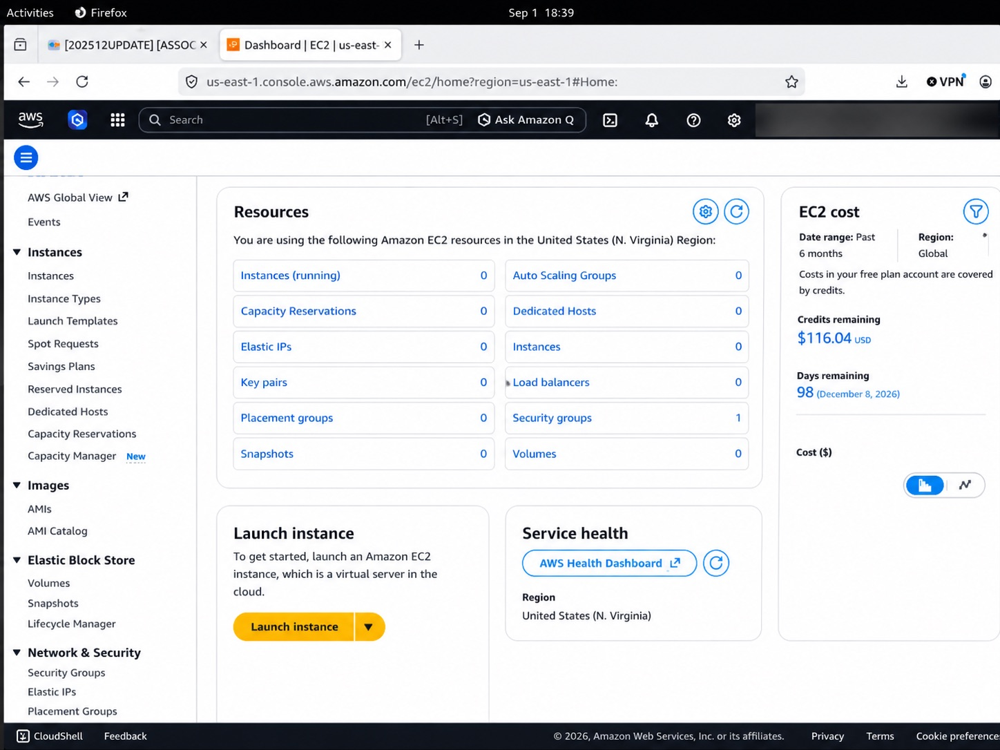
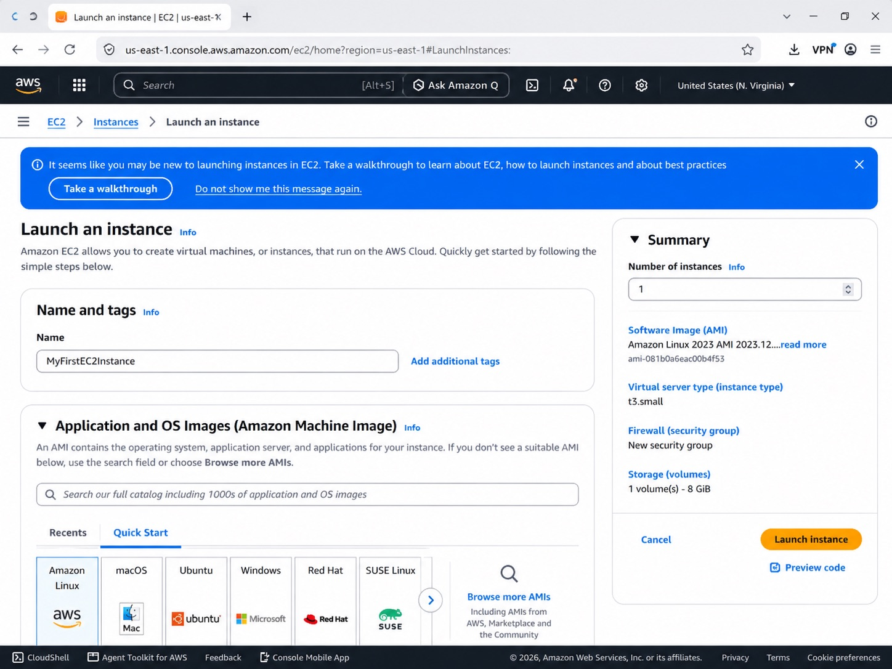

# Launching My First Amazon EC2 Instance

## Project Overview

In this project, I launched and configured my first Amazon EC2 instance while studying AWS cloud architecture.

The purpose of this project is to gain hands-on experience with Amazon EC2 and understand the components required to deploy a virtual server in AWS.

## AWS Services Used

- Amazon EC2
- Amazon Machine Images (AMI)
- Amazon EBS
- Amazon VPC
- AWS Security Groups

## Configuration

- Region: US East (N. Virginia)
- Operating System: Amazon Linux 2023
- Instance Type: t3.small
- Root Storage: 8 GiB gp3 EBS volume
- Network: Default VPC
- Security: Security Group with SSH access
- SSH Port: TCP 22

## Project Steps

### Step 1 - Open the Amazon EC2 Console

I navigated to the Amazon EC2 console and verified that no EC2 instances were currently running.

### Step 2 - Start the EC2 Launch Wizard

I selected **Launch Instance** to begin creating a new virtual server.

### Step 3 - Configure the EC2 Instance

I named the instance:

`MyFirstEC2Instance`

I selected **Amazon Linux 2023** as the Amazon Machine Image (AMI).

### Step 4 - Select an Instance Type

I selected a **t3.small** instance.

The instance type determines the amount of CPU, memory, networking capacity, and other resources available to the virtual server.

### Step 5 - Configure Networking and Security

The instance was deployed into the default VPC.

I created a security group and configured SSH access using TCP port 22 for this training lab.

### Step 6 - Configure Storage

I configured an 8 GiB gp3 Amazon EBS volume as the root volume for the EC2 instance.

### Step 7 - Launch the Instance

After reviewing the configuration, I launched the EC2 instance successfully.

## What I Learned

This lab helped reinforce my understanding of:

- What an EC2 instance is
- How Amazon Machine Images provide an operating system for EC2
- How instance types determine compute resources
- How EBS provides persistent block storage
- How security groups control network access
- How SSH key pairs are used to securely access Linux EC2 instances
- How EC2 instances are deployed inside an Amazon VPC

## Project Status

🚧 **In Progress**

I will continue updating this project as I complete additional EC2 labs.
