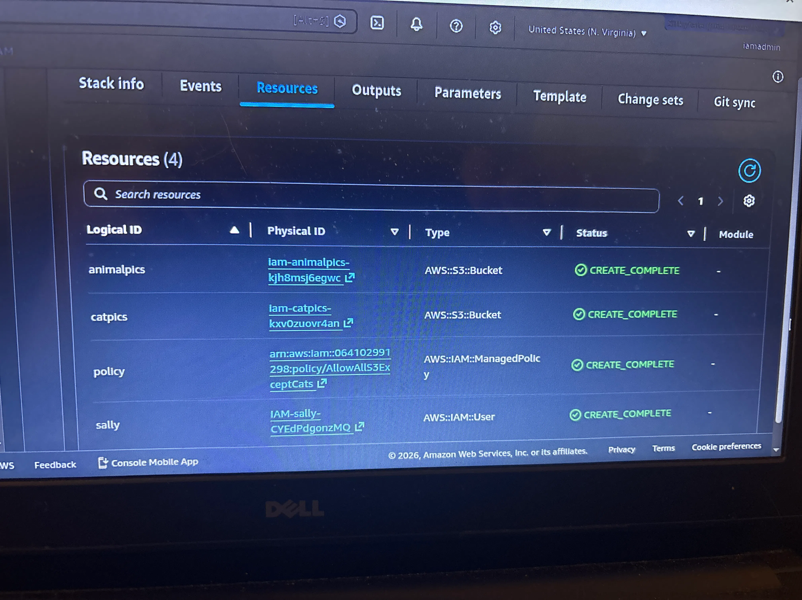

## Phase 1: Identity Foundation & Least Privilege

### 🏗️ Architecture & Design Decisions
In this phase, I deployed a simple identity permissions lab to demonstrate the principle of Least Privilege using Infrastructure as Code (CloudFormation):
*   **Automated Deployment:** Used a CloudFormation template to provision the IAM User, S3 Buckets, and custom policy, rather than manual console clicking.
*   **Explicit Deny:** Created a custom IAM policy (`AllowAllS3ExceptCats`) that allows full S3 access but explicitly denies access to a specific bucket. This proves that "Deny" rules override "Allow" rules in AWS.
*   **User Testing:** Logged in as the restricted user (`Sally`) to validate that the policy works exactly as intended in a live environment.

### 📸 Walkthrough & Screenshots
 

**1. Infrastructure as Code (CloudFormation)**
*   **Action:** Deployed the `demo_cfn.yaml` template to create:
    *   IAM User: `Sally`
    *   S3 Bucket: `iam-catpics` (The restricted bucket)
    *   S3 Bucket: `iam-animalpics` (The allowed bucket)
    *   IAM Policy: `AllowAllS3ExceptCats`
 
**2. Custom Least-Privilege Policy**
*   **Action:** Viewed the JSON for the `AllowAllS3ExceptCats` policy. It uses an `Allow` statement for `s3:*` on `*`, and a `Deny` statement specifically targeting the `catpics` bucket ARN.
*   *[Insert Screenshot: JSON Policy Editor showing the Allow and Deny blocks]*

**3. IAM User Setup**
*   **Action:** Confirmed the IAM User `Sally` was created via CloudFormation. Note that for this specific demo, the policy was attached directly to the user.
*   *[Insert Screenshot: IAM User 'Sally' details page showing the attached policy]*

**4. Testing Least Privilege (Live User Test)**
*   **Action:** Logged into a separate browser as `Sally` to test the policy in practice.
*   **Test Case A (Allowed):** Successfully uploaded a file (`thor.jpg`) to the `animalpics` bucket.
    *   *[Insert Screenshot: Successful S3 upload as Sally]*
*   **Test Case B (Denied):** Attempted to access the `catpics` bucket. Access was blocked, resulting in an error.
    *   *[Insert Screenshot: Access Denied/Error as Sally trying to view catpics]*

### 🛠️ Skills Demonstrated
*   AWS Identity and Access Management (IAM)
*   AWS CloudFormation (Infrastructure as Code)
*   JSON Policy Writing (Allow vs. Explicit Deny)
*   Least Privilege Principles
*   Live User Testing & Validation
