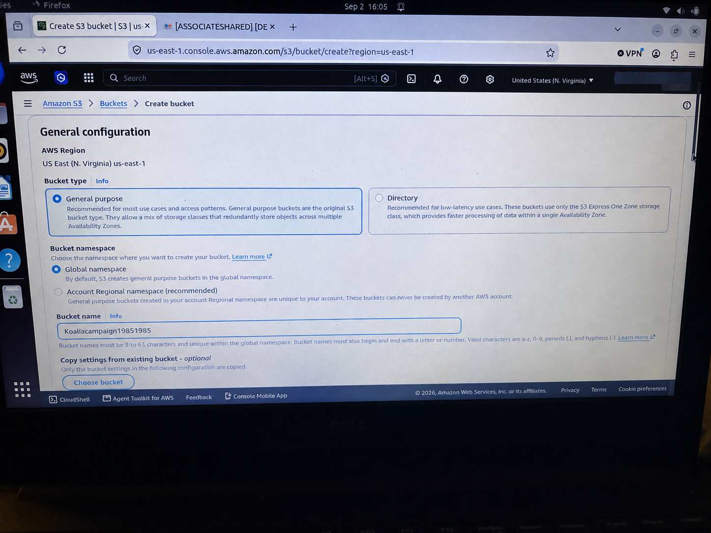
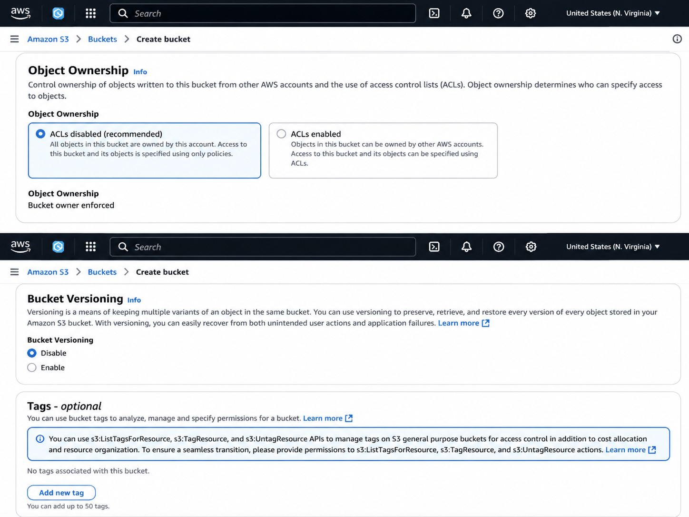
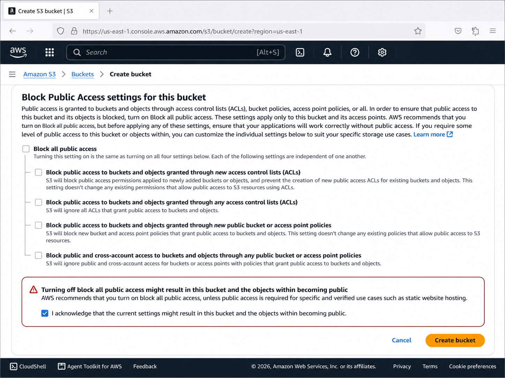
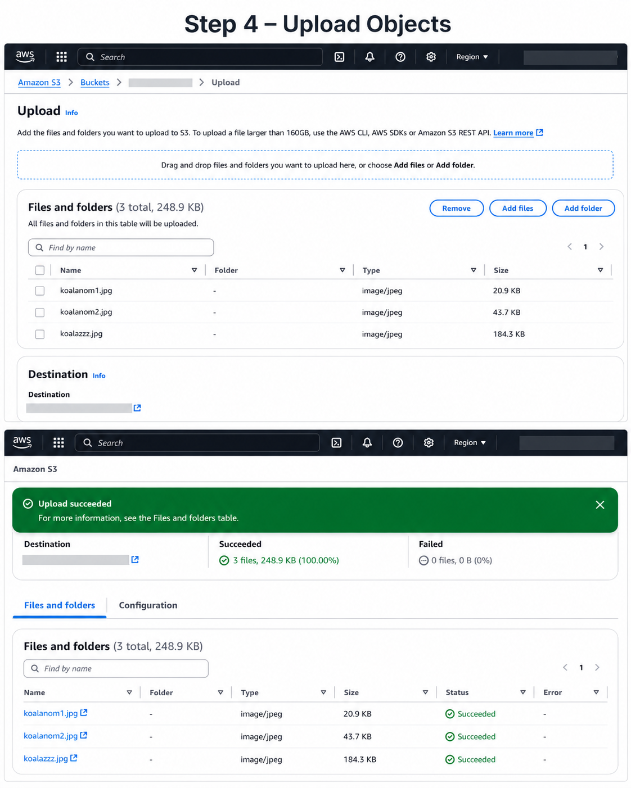
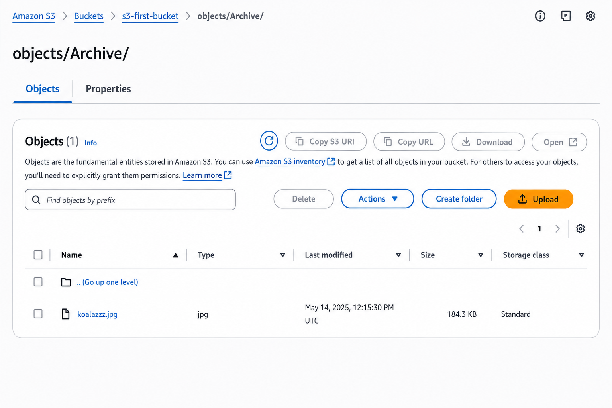

# Creating and Configuring an Amazon S3 Bucket

## Project Overview

In this project, I created and configured an Amazon S3 bucket while learning how AWS stores and manages objects.

The goal of this lab is to gain hands-on experience with S3 storage, permissions, and object management.

## AWS Services Used

- Amazon S3
- S3 Buckets
- S3 Objects
- Block Public Access
 

## Project Steps

### Step 1 - Open Amazon S3

I navigated to the Amazon S3 console to begin creating a new bucket.

### Step 2 - Create an S3 Bucket

I created a new S3 bucket and reviewed the bucket configuration options.

### Step 3 - Review Block Public Access

I reviewed the S3 Block Public Access settings and configured them according to the requirements of the lab.

### Step 4 - Upload Objects

I uploaded files to the S3 bucket and verified that the objects were stored successfully.

### Step 5 - Organize Objects Using S3 Folders

I created an S3 folder and placed an object inside it to understand how Amazon S3 organizes objects using prefixes rather than traditional filesystem folders.

## What I Learned

This lab reinforced my understanding of:

- How Amazon S3 stores objects
- How S3 buckets are created
- How Block Public Access helps protect buckets
- How objects are uploaded and managed
- How S3 uses object key prefixes to simulate folders

